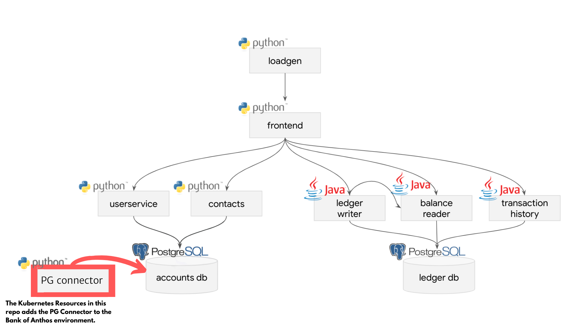

# PostgreSQL Connector Service

This depends on the environment: [bank-of-anthos](https://github.com/GoogleCloudPlatform/bank-of-anthos).

The PostgreSQL connector **plugs** in the **bank-of-anthos** enrivonment and pulls metadata from the accounts database and pushes in Google Data Catalog. This can be used in any GKE and Kubernetes environment to also connect with other PostgreSQL databases, by setting the environment variables with the correct values.

Implemented in Python with Flask using the [google-datacatalog-postgresql-connector](https://github.com/GoogleCloudPlatform/datacatalog-connectors-rdbms/tree/master/google-datacatalog-postgresql-connector).

**Disclaimer: This is not an officially supported Google product.**

<!--
  ⚠️ DO NOT UPDATE THE TABLE OF CONTENTS MANUALLY ️️⚠️
  run `npx markdown-toc -i README.md`.

  Please stick to 80-character line wraps as much as you can.
-->

## Table of Contents

<!-- toc -->

- [Endpoints](#endpoints)
- [Environment Variables](#environment-variables)
- [Kubernetes Resources](#kubernetes-resources)
- [Development Instructions](#development-instructions)
- [Deployment Instructions](#deployment-instructions)
- [Automated Sync](#automated-sync)
  * [Cron Deployment Instructions](#cron-deployment-instructions)

<!-- tocstop -->

-----

### Endpoints

| Endpoint                | Type  | Auth? | Description                                                        |
| ----------------------- | ----- | ----- | ------------------------------------------------------------------ |
| `/sync`                 | POST  | 🔒    |  Synchronize PostgreSQL metadata into Google Data Catalog.         |
| `/ready`                | GET   |       |  Readiness probe endpoint.                                         |
| `/version`              | GET   |       |  Returns the contents of `$VERSION`                                |

### Environment Variables

- `VERSION`
  - a version string for the service
- `PORT`
  - the port for the webserver
- `LOG_LEVEL`
  - the service-wide [logging level](https://docs.python.org/3/library/logging.html#levels) (default: INFO)

- ConfigMap `environment-config`:
  - `LOCAL_ROUTING_NUM`
    - the routing number for our bank
  - `PUB_KEY_PATH`
    - the path to the JWT signer's public key, mounted as a secret

- ConfigMap `accounts-db-config`:
  - `POSTGRES_DB`
    - name of `accounts-db` database
  - `POSTGRES_USER`
    - user of `accounts-db` database
  - `POSTGRES_PASSWORD`
    - pasword of `accounts-db` database

### Kubernetes Resources

- [deployments/postgresql-connector](postgresql-connector.yaml)
- [service/postgresql-connector](postgresql-connector.yaml)

### Development Instructions

- [development.md](development.md)

### Deployment Instructions

- [deployment.md](deployment.md)

### Automated Sync
You can automate the sync execution by adding a cron job to the architecture:

#### Cron Deployment Instructions

- [deployment-cron.md](deployment-cron.md)
